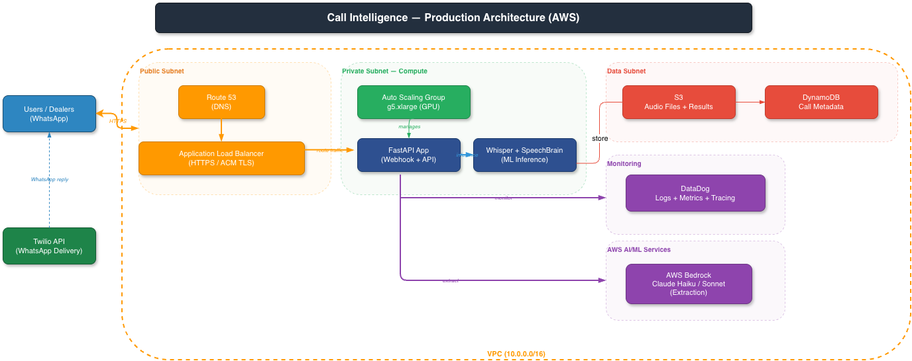

# Call Intelligence Pipeline: From Sales Call to Structured Summary in 60 Seconds

!!! tip "Marketplace Application"
Sales teams on any marketplace take dozens of calls a day. Follow-ups get missed. Action items get forgotten. There's no record of what was discussed or promised. This pipeline takes the raw call recording and delivers a structured summary — who said what, what needs to happen next — directly to the team's WhatsApp within a minute of hanging up. Works across English, French, German, and Spanish, making it practical for any marketplace operating across multiple markets.

!!! abstract "Project Summary"
**Domain**: Online Marketplace / Sales Call Intelligence
**Role**: ML Engineer (full system design & implementation)
**Scope**: 4 languages, 5-stage pipeline, real-time delivery

<div class="metric-grid" markdown>
<div class="metric-card">
<span class="metric-value">~60s</span>
<span class="metric-label">Total Processing (20min call)</span>
</div>
<div class="metric-card">
<span class="metric-value">4</span>
<span class="metric-label">Languages Supported</span>
</div>
<div class="metric-card">
<span class="metric-value">5</span>
<span class="metric-label">Pipeline Stages</span>
</div>
<div class="metric-card">
<span class="metric-value">10x</span>
<span class="metric-label">Cost Savings (Model Routing)</span>
</div>
</div>

## The Problem

Small and mid-size businesses receive dozens of phone calls daily but have no systematic way to extract insights from them. Important action items get lost, follow-ups are missed, and there's no searchable record of what was discussed. Existing transcription tools provide raw text but don't identify speakers or extract structured insights.

**The goal**: Build a complete pipeline that takes a raw phone call recording and delivers a structured summary with speaker attribution and action items - directly to the business owner's phone via WhatsApp.

## My Approach

### Five-Stage Pipeline Architecture

Each stage is independently optimised for its specific task:

<style>
.ci-wrap{font-family:'Segoe UI',system-ui,sans-serif;margin:1rem 0}
.ci-flow{display:flex;align-items:flex-start;flex-wrap:wrap;gap:0}
.ci-box{border-radius:8px;padding:10px 12px;font-size:12px;line-height:1.4;text-align:center;font-weight:500;color:#1e293b;flex-shrink:0;min-width:118px}
.ci-audio{background:#f1f5f9;border:2px solid #94a3b8}
.ci-lang{background:#fce7f3;border:2px solid #db2777}
.ci-trans{background:#dbeafe;border:2px solid #1d4ed8}
.ci-diar{background:#fef9c3;border:2px solid #ca8a04}
.ci-llm{background:#e9d5ff;border:2px solid #7c3aed}
.ci-wa{background:#dcfce7;border:2px solid #16a34a}
.ci-arrow{width:24px;flex-shrink:0;display:flex;align-items:center;justify-content:center;color:#64748b;font-size:16px;font-weight:bold;padding-top:10px}
.ci-tag{display:inline-block;background:#fef08a;border-radius:4px;padding:1px 5px;font-size:10px;font-weight:700;color:#713f12;margin-top:3px}
</style>

<div class="ci-wrap">
  <div class="ci-flow">
    <div class="ci-box ci-audio">🎙 Raw Audio<br><small>phone call recording</small></div>
    <div class="ci-arrow">→</div>
    <div class="ci-box ci-lang">🌐 Language Detection<br><small>Whisper Tiny<br><span class="ci-tag">~1s</span></small></div>
    <div class="ci-arrow">→</div>
    <div class="ci-box ci-trans">📝 Transcription<br><small>Whisper Large v3 Turbo<br><span class="ci-tag">~15s / 20min call</span></small></div>
    <div class="ci-arrow">→</div>
    <div class="ci-box ci-diar">👥 Speaker Diarization<br><small>SpeechBrain ECAPA-TDNN<br><span class="ci-tag">~3s</span></small></div>
    <div class="ci-arrow">→</div>
    <div class="ci-box ci-llm">🤖 LLM Extraction<br><small>Claude Haiku / Sonnet<br><span class="ci-tag">~2s</span></small></div>
    <div class="ci-arrow">→</div>
    <div class="ci-box ci-wa">💬 WhatsApp Delivery<br><small>Twilio · 3 messages<br><span class="ci-tag">instant</span></small></div>
  </div>
</div>

### Stage 1: Language Detection (~1s)

**Model**: Whisper Tiny (39M parameters)

The challenge with real-world calls: the first 30 seconds might be hold music, an IVR system, or silence. My solution samples audio at **multiple offsets** (0s, 30s, 60s) to find actual speech before detecting language. Falls back to English if all offsets fail.

### Stage 2: Transcription (~15s for 2min call)

**Model**: Whisper Large v3 Turbo

Key engineering decisions:

- **Chunked inference**: 30-second windows with 5-second stride for memory-efficient processing of calls of any length
- **Hallucination suppression**: `no_repeat_ngram_size=6`, logprob thresholds, compression ratio filtering - critical for handling real-world audio artifacts
- **Word-level timestamps**: Every sentence gets precise timing for downstream speaker attribution

### Stage 3: Speaker Diarization (~3s)

**Model**: SpeechBrain ECAPA-TDNN (192-dimensional speaker embeddings)

- Generates speaker embeddings per transcript segment
- Clusters via K-Means (fixed speakers) or Agglomerative clustering (threshold-based)
- Merges consecutive same-speaker segments into natural conversational turns
- Infers speaker roles with per-speaker talk time metrics

I chose SpeechBrain over pyannote for its lighter footprint and no dependency on HuggingFace authentication tokens - better for production deployment.

### Stage 4: LLM Extraction (~2s)

**Language-aware model routing** for cost optimization:

| Language                | Model         | Rationale                                         |
| ----------------------- | ------------- | ------------------------------------------------- |
| English                 | Claude Haiku  | 10x cheaper, sufficient for structured extraction |
| French, German, Spanish | Claude Sonnet | Better multilingual reasoning                     |

The system prompt enforces **evidence-grounding**: every claim in the summary must be traceable to a specific part of the transcript. Output is Pydantic-validated:

```json
{
  "summary": "Structured call summary...",
  "action_items": [{ "title": "Follow up on proposal", "description": "..." }]
}
```

### Stage 5: WhatsApp Delivery (~instant)

- FastAPI `BackgroundTasks` ensures Twilio receives a fast 200 response (webhook compliance)
- Pipeline runs asynchronously after webhook returns
- Results chunked to respect WhatsApp's 1,600-character message limit
- Three messages delivered: summary, action items, full speaker-attributed transcript

## System Architecture

<style>
/* ── shared ── */
.sa-title{font-family:'Segoe UI',system-ui,sans-serif;font-size:14px;font-weight:700;text-align:center;background:#1e293b;color:#f8fafc;border-radius:8px;padding:10px 16px;margin-bottom:16px}
.sa-wrap{font-family:'Segoe UI',system-ui,sans-serif;margin:1rem 0 1.8rem}

/* ── pipeline diagram ── */
.pip-sections{display:flex;gap:8px;margin-bottom:8px;padding-left:200px}
.pip-sec-label{font-size:10px;font-weight:700;letter-spacing:.05em;text-transform:uppercase;text-align:center;flex:1}
.pip-sec-speech{color:#3b82f6}
.pip-sec-speaker{color:#0d9488}
.pip-sec-ai{color:#7c3aed}
.pip-sec-delivery{color:#16a34a}
.pip-flow{display:flex;align-items:stretch;gap:0}
.pip-arrow{width:22px;flex-shrink:0;display:flex;align-items:center;justify-content:center;color:#475569;font-size:15px;font-weight:bold}
.pip-box{border-radius:8px;padding:10px 10px 6px;font-size:11.5px;line-height:1.4;text-align:center;font-weight:600;color:#fff;flex-shrink:0;min-width:130px;display:flex;flex-direction:column;gap:3px}
.pip-box small{font-weight:400;font-size:10.5px;opacity:.9}
.pip-note{font-size:10px;color:#64748b;font-style:italic;text-align:center;margin-top:2px;opacity:.85}
.pip-box-dark{background:#374151}
.pip-box-blue{background:#1e4d8c}
.pip-box-teal{background:#0e6e6e}
.pip-box-purple{background:#4c1d95}
.pip-box-green{background:#166534}
.pip-footer{display:flex;gap:6px;flex-wrap:wrap;margin-top:10px}
.pip-chip{border-radius:5px;padding:3px 9px;font-size:10.5px;font-weight:600;color:#fff}

/* ── AWS diagram ── */
.aws-vpc{border:2px dashed #f97316;border-radius:12px;padding:14px;margin-top:4px}
.aws-vpc-label{font-size:10px;font-weight:700;color:#f97316;text-align:right;margin-top:4px}
.aws-subnets{display:flex;gap:10px;flex-wrap:wrap}
.aws-subnet{border:1.5px dashed;border-radius:10px;padding:10px 12px;flex:1;min-width:160px}
.aws-subnet-pub{border-color:#f97316;background:#fff7ed}
.aws-subnet-priv{border-color:#22c55e;background:#f0fdf4}
.aws-subnet-data{border-color:#ef4444;background:#fef2f2}
.aws-subnet-mon{border-color:#7c3aed;background:#faf5ff}
.aws-subnet-aiml{border-color:#7c3aed;background:#faf5ff}
.aws-subnet-label{font-size:10px;font-weight:700;margin-bottom:8px}
.aws-subnet-pub .aws-subnet-label{color:#c2410c}
.aws-subnet-priv .aws-subnet-label{color:#15803d}
.aws-subnet-data .aws-subnet-label{color:#dc2626}
.aws-subnet-mon .aws-subnet-label,.aws-subnet-aiml .aws-subnet-label{color:#6d28d9}
.aws-box{border-radius:7px;padding:7px 10px;font-size:11px;font-weight:600;color:#fff;text-align:center;margin-bottom:6px;line-height:1.35}
.aws-box small{font-weight:400;font-size:10px;display:block;opacity:.9}
.aws-box-orange{background:#ea580c}
.aws-box-navy{background:#1e3a5f}
.aws-box-green{background:#16a34a}
.aws-box-red{background:#dc2626}
.aws-box-purple{background:#7c3aed}
.aws-box-blue{background:#2563eb}
.aws-box-teal{background:#0f766e}
.aws-outer{display:flex;gap:10px;align-items:flex-start;flex-wrap:wrap}
.aws-left{display:flex;flex-direction:column;gap:8px;min-width:130px}
.aws-arrow-h{display:flex;align-items:center;color:#475569;font-size:13px;font-weight:bold;margin:0 4px}
.aws-right{display:flex;flex-direction:column;gap:10px;flex:1}
.aws-right-row{display:flex;gap:10px;flex-wrap:wrap}
</style>

### Pipeline Architecture

<div class="sa-wrap">
<div class="sa-title">Call Intelligence — Pipeline Architecture</div>

<div class="pip-sections">
  <div class="pip-sec-label pip-sec-speech">Speech Processing</div>
  <div class="pip-sec-label pip-sec-speech" style="flex:.1"></div>
  <div class="pip-sec-label pip-sec-speaker">Speaker Analysis</div>
  <div class="pip-sec-label pip-sec-ai" style="flex:.1"></div>
  <div class="pip-sec-label pip-sec-ai">AI Extraction</div>
  <div class="pip-sec-label pip-sec-delivery" style="flex:.1"></div>
  <div class="pip-sec-label pip-sec-delivery">Delivery</div>
</div>

<div class="pip-flow">
  <div class="pip-box pip-box-dark" style="min-width:150px">
    🎙 1 · Audio Input<br>
    <small>Phone Call Recording<br>WAV / OGG / MP3<br>WhatsApp Bot or File Upload</small>
  </div>
  <div class="pip-arrow">→</div>
  <div class="pip-box pip-box-blue">
    🌐 2 · Language Detection<br>
    <small>Whisper Tiny (39M params)<br>Multi-offset 30s sampling<br>0s / 30s / 60s offsets</small>
  </div>
  <div class="pip-arrow">→</div>
  <div class="pip-box pip-box-blue">
    📝 3 · Transcription<br>
    <small>Whisper Large v3 Turbo<br>30s chunks, 5s stride<br>Word-level timestamps</small>
  </div>
  <div class="pip-arrow">→</div>
  <div class="pip-box pip-box-teal">
    👥 4 · Speaker Diarization<br>
    <small>SpeechBrain ECAPA-TDNN<br>192-dim embeddings<br>K-Means / Agglomerative</small>
  </div>
  <div class="pip-arrow">→</div>
  <div class="pip-box pip-box-purple">
    🤖 5 · LLM Extraction<br>
    <small>Claude Haiku 4.5 (EN)<br>Claude Sonnet 4.6 (other)<br>Pydantic JSON schema</small>
  </div>
  <div class="pip-arrow">→</div>
  <div class="pip-box pip-box-green">
    💬 6 · WhatsApp Delivery<br>
    <small>Twilio API<br>Summary + Action Items<br>Speaker Transcription</small>
  </div>
</div>

<div class="pip-footer">
  <span class="pip-chip" style="background:#374151">Python 3.11</span>
  <span class="pip-chip" style="background:#1e4d8c">Whisper</span>
  <span class="pip-chip" style="background:#0e6e6e">SpeechBrain</span>
  <span class="pip-chip" style="background:#4c1d95">Claude (Bedrock)</span>
  <span class="pip-chip" style="background:#166534">Twilio</span>
  <span class="pip-chip" style="background:#1e3a5f">FastAPI</span>
  <span class="pip-chip" style="background:#78350f">Pydantic</span>
  <span class="pip-chip" style="background:#1e40af">Hydra</span>
</div>
</div>

### AWS Production Architecture



The system supports three execution modes:

- **CLI mode**: Direct processing for development and testing
- **API mode**: FastAPI server for integration with other services
- **WhatsApp bot**: Twilio webhook for end-user interaction

**Configuration**: Hydra + OmegaConf for hierarchical YAML configs with per-environment overrides (dev/staging/prod).

**Production deployment**: AWS architecture with auto-scaling GPU instances, DynamoDB for metadata, S3 for audio storage, and Datadog for monitoring.

## Tech Stack

`Python` `FastAPI` `Whisper` `SpeechBrain ECAPA-TDNN` `Claude Haiku` `Claude Sonnet` `AWS Bedrock` `Twilio` `Hydra` `Pydantic` `DynamoDB` `S3` `Datadog` `Docker`

## Key Takeaways

- **Multi-offset language detection** handles real-world call artifacts (silence, IVR, hold music) that break naive detection
- **Chunked Whisper inference** with overlapping windows enables memory-efficient processing of arbitrarily long calls
- **Language-based model routing** (Haiku for English, Sonnet for multilingual) delivers 10x cost savings without quality loss
- **Embedding-based diarization** via SpeechBrain provides lighter-weight speaker identification than pyannote with fewer deployment dependencies
- **Background webhook processing** is essential for real-time messaging integrations - never block the webhook response
